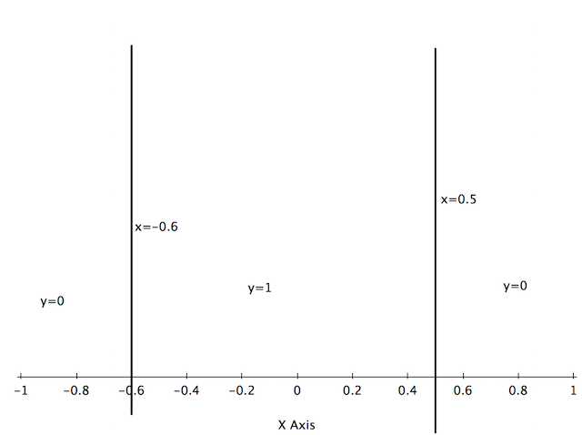

# Homework 1
Zhe Wang
A53097553

### Question 2

(a) The bayes-optimal classifier for this setting is

$$h^*(x) = \begin{cases}
1 \quad \text{if} -0.5 \leq x \leq 0.5\\
0 \quad \text{otherwise}
\end{cases}$$

$$P(x < 0.5) = \int_{-1}^{-0.5} \mu(x) dx = \int_{-1}^{-0.5} |x| dx = \int_{-1}^{-0.5} -x dx = 0.375$$

$$P(x > 0.5) = \int_{0.5}^{1} \mu(x) dx = \int_{0.5}^{1} x dx = 0.375$$

$$P(-0.5 \leq x \leq 0.5) = 1 - P(x < 0.5) - P(x > 0.5) = 0.25$$

$$R^* = P(x < 0.5)*min(0.2, 0.8) + P(-0.5 \leq x \leq 0.5)*min(0.8, 0.2) + P(x > 0.5)*min(0.4, 0.6) = 0.0725$$

---

(b) The decision boundary of 1-NN using this training set is $$x=-0.6$$
and $$x=0.5$$.

Error rate = $$P(-1\leq X \leq -0.6)P(Y=1|-1\leq X \leq -0.6) + P(-0.6 \leq X \leq 0.5)P(Y=0|-0.6 \leq X \leq 0.5)$$ $$ + P(0.5\leq X \leq 1)P(Y=1| 0.5\leq X \leq 1)$$.

For the first term, $$P(Y=1|-1\leq X \leq -0.6) = 0.32$$, $$P(Y=1|-1\leq X \leq -0.6) = 0.2$$, Therefore $$P(-1\leq X \leq -0.6)P(Y=1|-1\leq X \leq -0.6)=0.32*0.2 = 0.064 $$.

For the second term, $$P(-0.6 \leq X \leq 0.5)P(Y=0|-0.6 \leq X \leq 0.5)$$ $$ = P(-0.6 \leq X \leq -0.5)P(Y=0|-0.6 \leq X \leq -0.5) + P(-0.5 \leq X \leq 0.5)P(Y=0|-0.5 \leq X \leq -0.5)$$ $$=0.055*0.8 + 0.25*0.2 = 0.094$$

For the third term, $$P(0.5\leq X \leq 1)P(Y=1| 0.5\leq X \leq 1)$$ $$=0.4*0.375=0.15$$.

Therefore, the error rate = $$0.064 + 0.094 + 0.15 = 0.308$$

---

(c) and (d)

From Professor Charles' paper [The Foundations of Cost-Sensitive Learning](http://web.cs.iastate.edu/~honavar/elkan.pdf)

> In the two-class case, the optimal prediction is class 1 if and only if the expected cost of this prediction is less than or equal to the expected cost of predicting class 0.

For out problem, $$c_{00} = 0, c_{11} = 0, c_{10} = 0.1, c_{01}=1$$.

$$h(x) \geq 1 \Leftrightarrow P(Y=0|x)*c_{01} \leq P(Y=1|x)*c_{10}$$
$$\Leftrightarrow (1-\eta(x))*c_{01} \leq \eta(x)*c_{10}$$
$$\Leftrightarrow \eta(x) \geq \frac_{c_{01}}{c_{01} + c_{10}}$$

$$h^*(x) = \begin{cases}
1 \quad \text{ if } \eta(x) > 10/11\\
0 \quad \text{otherwise}
\end{cases}
$$

(d)
### Question 3

(a) $$l1$$ distance is metric. 
1. 
 $$d(x, y) = ||x-y||_1 = \sum_{i=1}^{m}|x_i-y_i| \geq \sum_{i=1}^{m}0 = 0 $$ 
2. 
    * $$d(x, y) = 0 \Rightarrow \sum_{i=1}^{m}|x_i-y_i| = 0 \Rightarrow |x_i - y_i|=0 \text{ for each i}$$ $$\Rightarrow x_i = y_i\text{ for each i} \Rightarrow x=y$$.  
    * $$x=y \Rightarrow x_i = y_i \text{ for each i} \Rightarrow \sum_{i=1}^{m}|x_i - y_i| = 0 \Rightarrow d(x, y) = 0$$
3. 
$$d(x, y) = \sum_{i=1}^{m}|x_i-y_i| = \sum_{i=1}^{m}|y_i-x_i| = d(y, x)$$
4.  
$$d(x, y) + d(y, z) = \sum_{i=1}^{m}|x_i-y_i| + \sum_{i=1}^{m}|y_i-z_i| = \sum_{i=1}^{m}(|x_i-y_i|+|y_i-z_i|) \leq \sum_{i=1}^{m}(|x_i-z_i|) = d(x, z)$$

---

(b) $$d_1 + d_2$$ is metric

Let $$d = d_1 + d_2$$, then $$d(x,y)=d_1(x,y)+d_2(x,y)$$

1. 
Since $$d_1(x,y) \geq 0$$ and $$d_2(x,y)\geq 0$$ and $$d(x,y) = d_1(x,y) + d_2(x,y)$$, we have $$d(x,y) \geq 0$$.
2. Since $$d_1(x,y) \geq 0$$, $$d_2(x,y) \geq 0$$, and $$d(x,y) = d_1(x,y) + d_2(x,y)$$, we have $$d(x,y) = 0 \Leftrightarrow d_1(x, y) = 0 \text{ and } d_2(x,y)=0 \Leftrightarrow x=y$$.
3. $$d(x,y) = d_1(x,y) + d_2(x,y) = d_1(y, x) + d_2(y, x)=d(y,x)$$.
4. $$d(x,z) = d_1(x, z) + d_2(x, z)  \leq d_1(x, y) + d_1(y,z) + d_2(x,y)+d_2(y,z) = $$  
$$(d_1(x, y) + d_2(x,y)) + (d_1(y,z) +d_2(y,z)) = d(x,y) + d(y, z)$$

---

(c) Hamming distance is metric.
From the definition of Hamming distance, 
* $$d(x, y) \geq 0$$ is true since the number of different positions must $$\geq 0$$;  
* $$d(x, y)=0 \Leftrightarrow \text{ x and y are equal in every position} \Leftrightarrow x = y$$; 
* $$d(x,y) = d(y,x)$$ is true since changing the value of x,y with each other doesn't influence the number of positions on which those to values are different.
* Suppose $$S_a$$ is the set of positions on which x and y are differ, $$S_b$$ is the set of positions on which y and z are differ. Thus, x and z are differ for all positions in $$S_a - (S_a \cap S_b) \text{ and }  S_b - (S_a\cap S_b)$$ (For those in the first one, x y are different and y z are same; and for those in the second one x y are same and y z different). For those positions in $$(S_a \cap S_b)$$, x z may or may not different since x y are different and y z are different. For those positions out of $$S_a \text{ and } S_b$$, x y z are the same.   
Therefore, $$d(x,z) <= |S_a - (S_a \cap S_b)| + |S_b - (S_a\cap S_b)| + |S_a \cap S_b|$$ by inclusion–exclusion principle $$ = |S_a| + |S_b| - |S_a\cap S_b| = d(x, y) + d(y, z) - |S_a\cap S_b| <= d(x, y) + d(y, z)$$.
---
(d) Squared Euclidean is not metric.  
Consider the case where $$m=1, x=1, y=0, z=-1$$, then $$d(x,z) = 4, d(x,y) = 1, d(y,z) = 1$$. Thus, $$d(x,z) > d(x,y) + d(y,z)$$

---

(e) Kullback-leibler dvergence is not metric.  
Consider the case where 
$$ X = 
\begin{pmatrix}
0.2\\
0.8
\end{pmatrix}
$$ , 
$$Y = 
\begin{pmatrix}
0.5\\
0.5
\end{pmatrix}
$$, $$K(p,q)=0.1927, K(q,p)= 0.2231$$. Then $$K(p,q) \neq K(q,p)$$, $$K$$ is not metric. 

