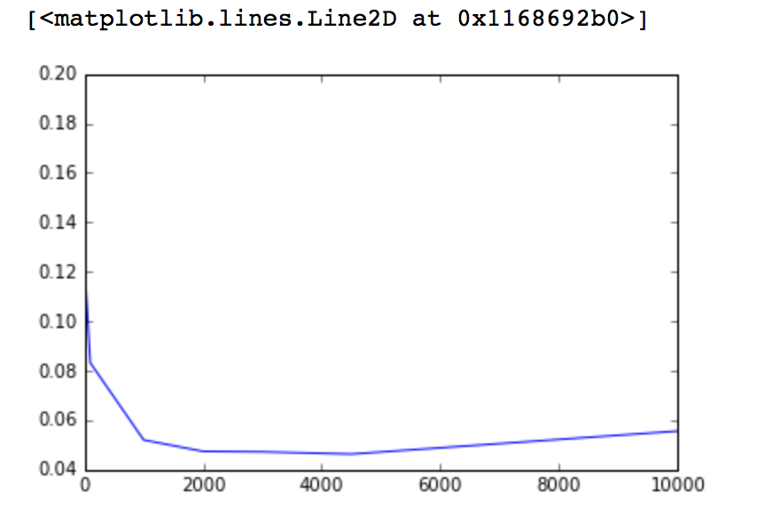
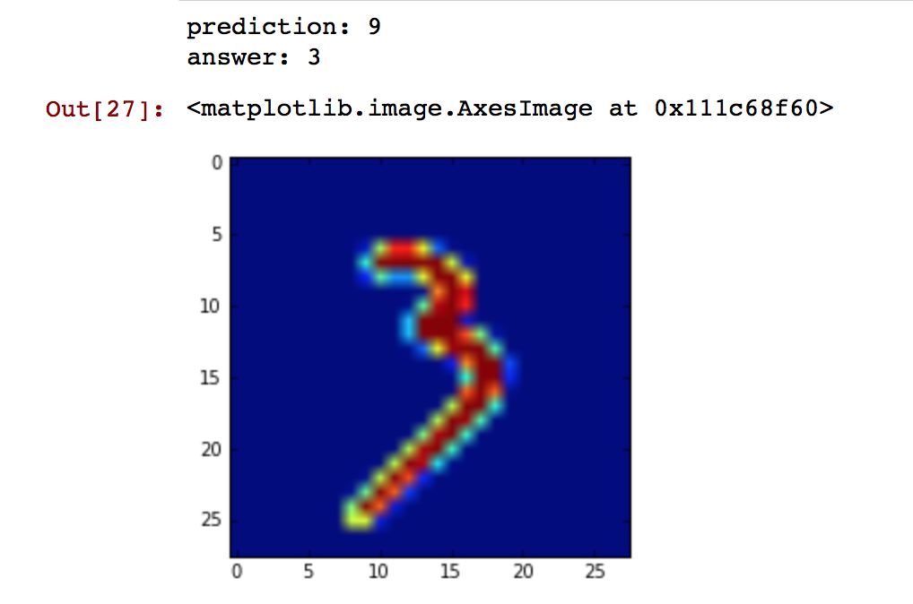
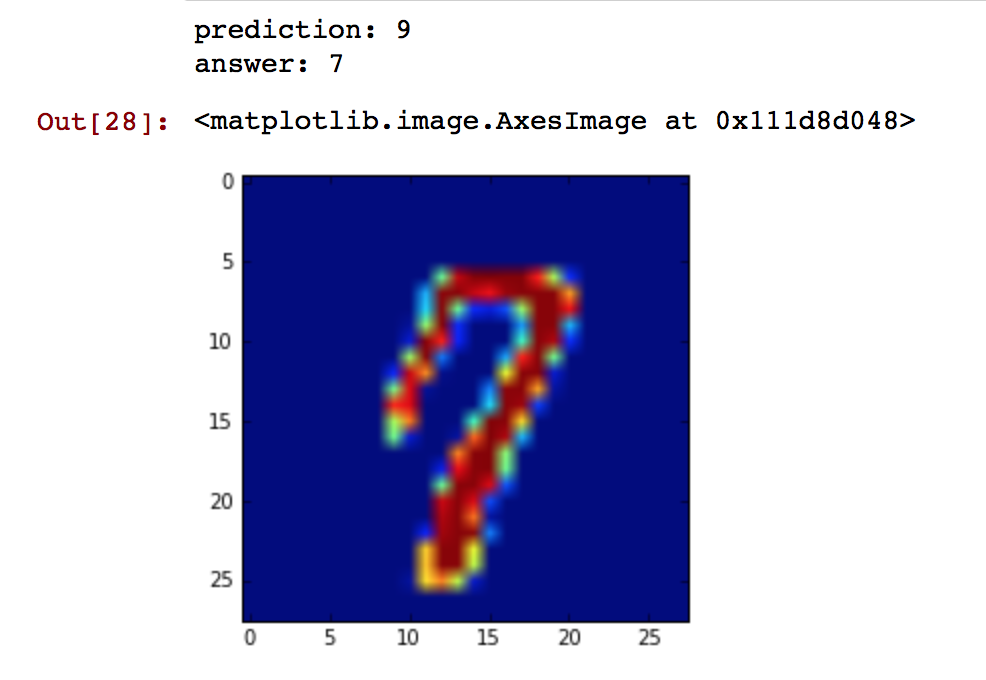
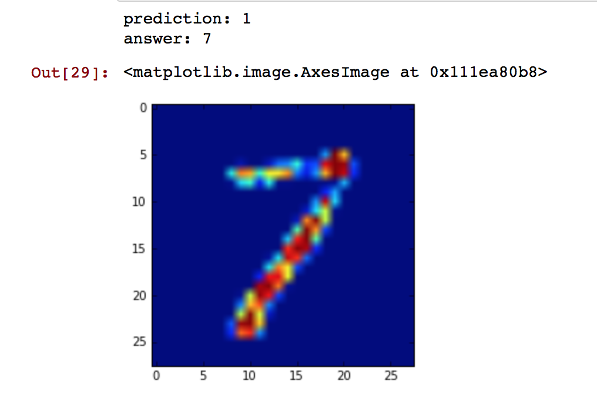
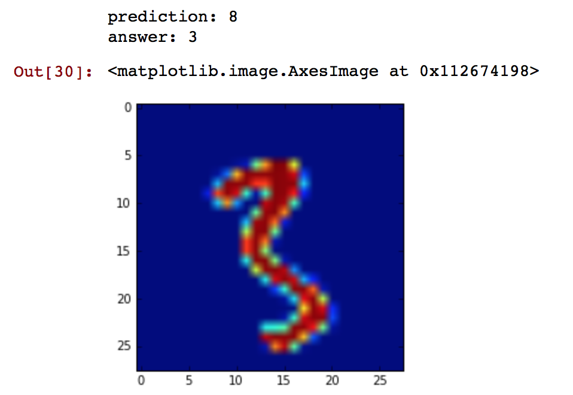
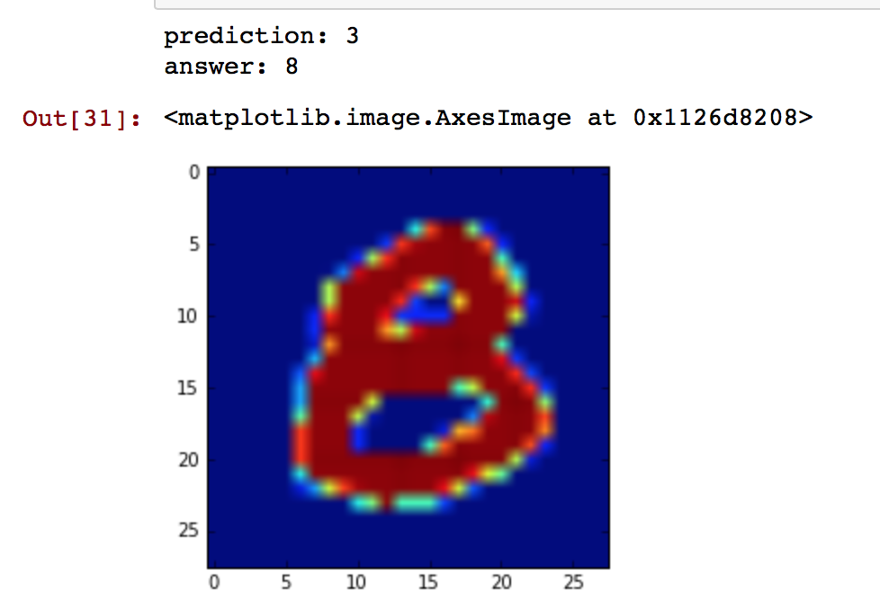

# 250b-hw3

##Question 5

(A) 

* Create the validation set: randomly pick 10000 images from the test data set, the validation set will be used to compute $$c$$.
* Prediction rule: let $$X$$ be the set of images, and $$Y$$ be the the class, the prediction rule will be: $$argmax_t(P(y=t|x))$$.

**Pseudo code:**

* Randomly choose 10000 images from test data as validation set.
* First train: train the model based on the remaining 50000 images of the test set.
    * For each digit $$i$$, let $$X^{(i)}$$ be its corresponding images ($$X^{(i)}$$ is a matrix, each row of it is an image vector, and each column of $$X^{(i)}$$ corresponds with a particular pixel), $$m$$ is the number of rows in that matrix (the number of images corresponding with digit $$i$$).
        * compute $$\mu = \frac{\text{sum_of_col}(X^{(i)})}{m}$$.
        * compute covariance matrix $$\Sigma = \frac{X^{(i)T}X^{(i)}}{m}$$

* validate(c):
    * $$\Sigma' = \Sigma + cI$$
    * Since  
    $$argmax_y{P(y|x)} = argmax\frac{P(x|y)P(y)}{P(x)} = argmax_y\{logP(x|y)) + P(y)\} $$.  
    Then for each digit i, compute its corresponding log-probability:
        * 
        
    

(B)

Validation error vs. $$c$$

Thus we choose $$c$$ as $$3000$$, and the test error is $$4.447\%$$

(C)

**Instance 1:**
* Display

* Posterior probability

| $$y$$ | $$P(y|x)$$ |
| -- | -- |
| 0 | 7.810133162378638e-24 |
| 1 | 5.42518729267856e-27 |
| 2 | 1.7936848773579598e-18 |
| 3 | 0.01032112687492998 |
| 4 | 7.460938904087614e-18 |
| 5 | 1.6463801848890495e-11 |
| 6 | 9.773144187743508e-42 |
| 7 | 0.22176903132443038 |
| 8 | 1.281426322574839e-15 |
| 9 | 0.7679098417842578 |

 
**Instance 2:**

* Display

* Posterior probability

| $$y$$ | $$P(y|x)$$ |
| -- | -- |
| 0 | 2.681674944719141e-51 |
| 1 | 2.5045194305198344e-38 |
| 2 | 1.5835991948443693e-44 |
| 3 | 3.5289052550687546e-35 |
| 4 | 5.210530585516586e-16 |
| 5 | 4.7799496648355003e-51 |
| 6 | 5.061990318174945e-67 |
| 7 | 5.70767303583582e-05 |
| 8 | 4.539330755809185e-20 |
| 9 | 0.9999429232698611 |

**Instance 3**
* Display

* Posterior probability

| $$y$$ | $$P(y|x)$$ |
| -- | -- |
| 0 | 1.9094442170371198e-41 |
| 1 | 0.9999999983374437 |
| 2 | 7.821751593360222e-23 |
| 3 | 1.1599373823253779e-29 |
| 4 | 9.199759045781672e-16 |
| 5 | 2.340694847895411e-38 |
| 6 | 3.3169484762319035e-41 |
| 7 | 1.6595603866765108e-09 |
| 8 | 1.3115350633315786e-15 |
| 9 | 3.076646733216899e-12 |

**Instance 4**
* Display

* Posterior probability

| $$y$$ | $$P(y|x)$$ |
| -- | -- |
| 0 | 2.0260389120279604e-41 |
| 1 | 2.265669093427109e-29 |
| 2 | 3.951457118185343e-20 |
| 3 | 0.0003465940111252581 |
| 4 | 4.08132846119485e-19 |
| 5 | 2.809776924309377e-08 |
| 6 | 4.347049242091492e-57 |
| 7 | 3.1244224237313185e-35 |
| 8 | 0.9996533778910057 |
| 9 | 1.4934080797470245e-17 |

**Instance 5**

* Display

* Posterior probability

| $$y$$ | $$P(y|x)$$ |
| -- | -- |
| 0 | 6.679376802740146e-11 |
| 1 | 4.2119075793346217e-212 |
| 2 | 6.137368691196682e-11 |
| 3 | 0.9999999958372427 |
| 4 | 6.454323815773716e-67 |
| 5 | 3.3860234533437196e-11 |
| 6 | 6.6830957585291545e-18 |
| 7 | 1.2153042215356328e-116 |
| 8 | 4.0005126493011125e-09 |
| 9 | 5.32280222872815e-63 |